# FreeCAD 的工具条

## 全部默认的工作台

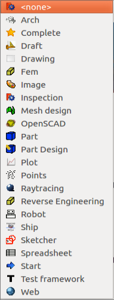

### 1. Arch （建筑）

#### 文件

- 新建 Ctrl+N
- 打开 Ctrl+O
- 保存 Ctrl+S
- 打印 Ctrl+P
- 剪切 Ctrl+X
- 复制 Ctrl+C
- 粘贴 Ctrl+V
- 撤销 Ctrl+Z
- 重做 Ctrl+Shift+Z
- 刷新 Ctrl+R
- 工作台 选择框
- 帮助 Shift+F1

#### 宏

- 录制宏
- 停止录制
- 编辑宏
- 运行宏 Ctrl+F6

#### 视图
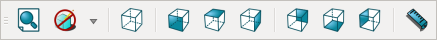
- 全显
- 样式 选择
- 轴侧图 0 
- 前视图 1
- 顶视图 2
- 右视图 3
- 后视图 4
- 底视图 5
- 左视图 6
- 测量

#### Draft tray （草图托盘）

- 草图平面
- 切换构造模式  ？
- 线条颜色
- 表面颜色
- 线宽
- 字体大小
- 应用于选中对象

#### Arch tools

- 
- 
- 

#### Draft tools （Draft绘制工具）

- 线段
- 多线段
- 圆
- 圆弧
- 椭圆
- 正多边形
- 矩形
- 注释
- 尺寸标注
- B样条曲线
- 点
- facebinder  ？
- Bezier曲线

#### Draft mod tools （Draft修改工具）

- 移动
- 旋转
- 偏移
- 修剪
- 连接
- 分解
- 缩放
- 投影 （似乎只能投影到XY平面）
- Draft和Sketch切换
- 阵列
- 克隆

#### Draft Snap （Draft捕捉）

- 开关
- 中点
- 垂直点
- 网格
- 交点
- 平行  ？
- 端点
- 象限点
- 圆心
- 延伸点
- 最近点
- 正交
- 尺寸  ？
- 工作板  ？

### 2. Complete （全部）

Drafting

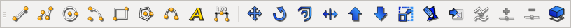

#### Drawings

- 打开自定义SVG文件
- 打开标准图幅 （如A3）
- 插入零件
- 正交视图
- 浏览器打开
- 插入注释视图
- 插入剪辑组
- 插入SVG符号
- 插入Draft视图
- 导出为SVG文件

Part

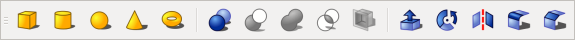

Raytracing

### 3. Draft

Draft Snap

Draft tray

绘图创建工具

绘图修改工具

### 4. Drawing

图纸

### 5. Fem （有限元）

有限元

### 6. Image （图像）

图像

### 7. Inspection （检查）

空

### 8. Mesh design

网格工具

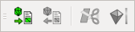

### 9. OpenSCAD

OpenSCAD Part tools

OpenSCADTools

### 10. Part

#### 实体
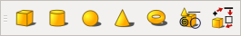
- 正方体
- 圆柱体
- 球体
- 圆锥体
- 圆环体
- 几何元
- 高级工具  ？ 不会用

#### 零件工具

- 拉伸
- 旋转
- 镜像
- 圆角
- 倒角
- 两边生成面
- 放样
- 扫掠
- 偏移 ？ 搞不懂
- 抽壳

#### 布尔值
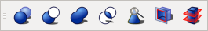
- 布尔运算
- 差集
- 合集
- 交集
- 分析错误
- 交线
- 横界面

#### Measure
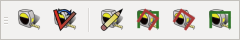
- 线性测量
- 角度测量
- 清空
- Toggle All  ?
- Toggle 3d  ?
- Toggle Delta  ?

### 11. Part Design

#### 零件设计
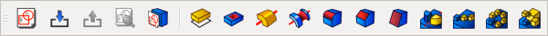
- 新建草绘
- 编辑
- 关闭
- 正视草图
- 投影到面
- 凸台
- 凹槽
- 旋转
- 旋转槽
- 圆角
- 倒角
- 拔模  ？
- 镜像
- 线性阵列
- 环形阵列
- 转换特征  ？  不会用

#### 草绘几何体

- 点
- 线
- 弧
- 圆
- 椭圆
- 多线
- 矩形
- 多边形
- 腰形
- 圆角
- 修剪
- 投影
- 辅助线

#### 草图约束

- 点重合
- 点重合到线
- 垂直
- 水平
- 平行
- 垂直
- 相切
- 相等
- 对称
- 固定
- 水平标注
- 垂直标注
- 平行标注
- 半径
- 角度
- 折线  ？

#### Sketcher tools
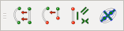
-  
- 
- 

### 12. Plot

Plot edition tools

### 13. Points

点工具

### 14. Raytracing

Raytracing tools

### 15. Reverse Engineering

逆向工程

### 16. Robot

机器人

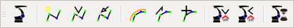

### 17. Ship

Ship design

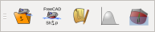

Weights

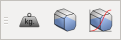

### 18. Sketcher

草绘

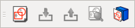

### 19. Spreadsheet

Spreadsheet

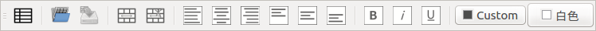

### 20. Start

Navigation

### 21. Test framework

TestTools

### 22. Web

