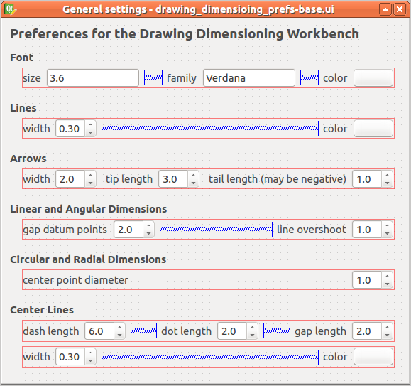
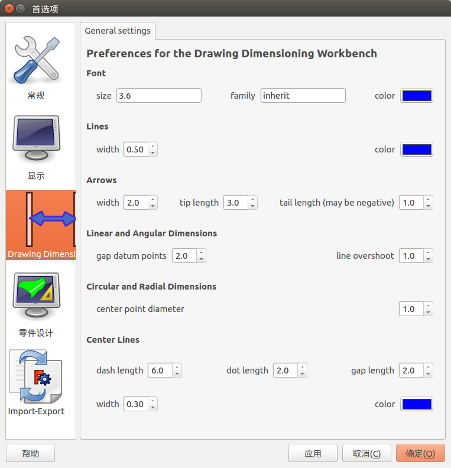
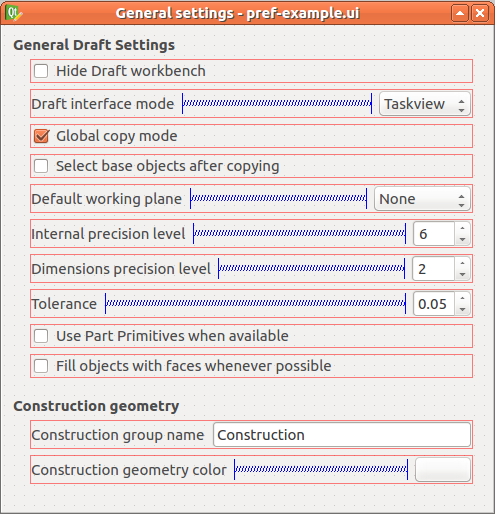
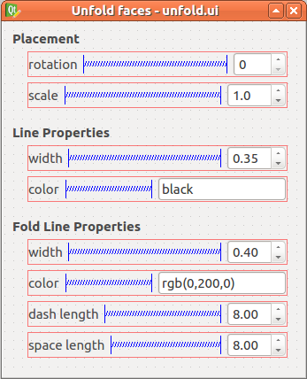
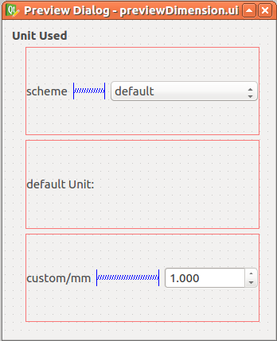
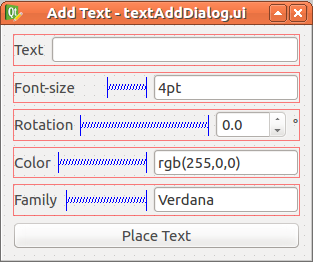
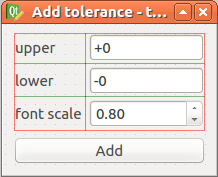
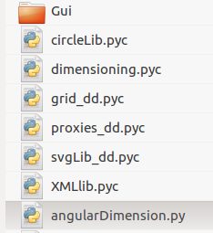
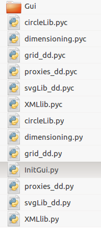

# 程序设计

## 界面
### 资源目录下的三个界面文件
#### /Gui/Resources/ui/drawing_dimensioing_prefs-base.ui

#### 对应的应用界面

#### /Gui/Resources/ui/pref-example.ui

#### /Gui/Resources/ui/unfold.ui

### 处于根目录下的三个界面文件
#### previewDimension.ui

#### textAddDialog.ui

#### toleranceDialog.ui

## 其他
### 初始化时最先产生pyc的py文件

### 满足基本要求的文件
